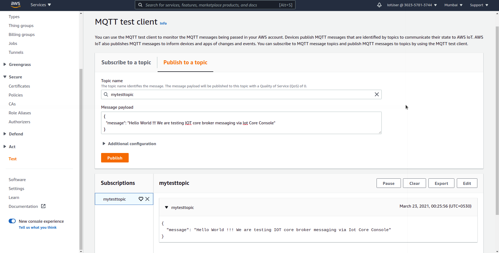

# AWS IOT Core tutorial with Python - Part 1

Hello builders and developers, this new tutorial on IOT with AWS is released to teach you about the amazing service of IOT Core provided by AWS and has wide applications in industrial systems and IOT systems in a production grade scale. There are although various systems into IOT like Message-Brokers, Databases, Dashboards, etc, however AWS IOT Core is so good that it provides you the environment to use all the systems as a managed service, ready to put into production and also simple for just prototyping needs. AWS IOT Core can easily be linked to other web and cloud services provided by AWS thus a friendly environment is provided where we can easily design and develop IOT systems in a distributed architecture. So let's get started with some basic concepts and then dive into practical applications of AWS Iot Core. 

### Introduction

#### What is AWS ?

Amazon Web Services or AWS is a PaaS(Product as a Service) platform managed by the tech and logistic giant company AMAZON. AWS provides on-demand cloud computing platforms and APIs to individuals, companies, and governments, on a metered pay-as-you-go basis. Similar services like AWS are Microsoft's Azure, Google Cloud, DigitalOcean, etc. However AWS is supposed to be the best and most secured service beacause of it simplicity, efficiency and security. In order to develop a full fledged production grade, scalable and secured system AWS is the best as we can bootstrap systems and services provided by it and easily architect a great scalable distributed system in any cloud related domains of computer science.

First I would list out some terms and explain in breif their significance -

**1. AWS Root User and AWS IAM User** :  So those who have an AWS account, would have used a username/email and password to sign in to their AWS console. This user is always the root user. If any of us creates and AWS account with an email and the info AWS requires to signup, the user's email and password becomes the root user credentials and user itself is the root user of that AWS account. Root user can access all the services from AWS in all regions and has all the administrative priviledges for the account such as billing, credits, etc. Now suppose if there is a company and there are multiple developers working on multiple roles say web development, iot development, devops, etc, each of these developers would be using AWS for their work and more specifically different services in AWS. Now if the company gives access to all these developers with their root user credentials, then any employee(developer) can access all the services running, they can do mischevious things and anyways, the security of the account is at stake and if something bad happens say if a server gets stopped or anything crazy, company would not know who did it.

To overcome this issue AWS provides an **IAM User** which only a root user can create and manage. The root user (company) can now create as many IAM Users as required and also restrict a particular IAM User from accessing all other services accept the ones it is authorised to use. An IAM user also have a set of credentials which can be used for sign in to AWS console. 

**2. AWS Policies** : AWS Policies are set of rules that restrict or provide access to other AWS services or Users to interact with systems and services managed under AWS. Policies contribute a lot to the security of the PaaS(Product as a Service) systems provided by AWS. In the previous topic I mentioned that the root user can provide access to only specific services to an IAM user. So how is that possible ? Yes you guessed it right, each time a new IAM User is created a policy is also created for that particular user, we shall see that practically in a bit.  However not only for an IAM user, policies are used throughout AWS and are associated with the services as well defining which service/user can interact with which other services. 

**3. Certificates** : After policies provide a basic security layer another very important and highly efficient security layer is provided by certificates. These certificates are very common with most of the AWS services and not only with AWS, certificates are something which are being used with every cloud platform to provide cyber security. A security certificate is a small data file used as an Internet security technique through which the identity, authenticity and reliability of a website or Web application is established. Along with certificate file there are 2 other type of encryption keys which makes the system more secured, these are private-key, public-key, which we will look into when we do things in practical.

**4. IOT Core** : AWS IoT Core lets you connect IoT devices to the AWS cloud without the need to provision or manage servers. AWS IoT Core can support billions of devices and trillions of messages, and can process and route those messages to AWS endpoints and to other devices reliably and securely. It provides us all the things necessary to build an IOT system most importantly a secured Messaging Broker. Previously we had to deploy a Mosquitto broker for messaging and manage that server seprately, now that stuff can easily be done on IOT core with least efforts.

**5. Things** : The whole IOT is just the old internet without Things. In IOT core Things are generally those devices which are connected to IOT system. Eg - a sensor, a car, a home, a lightbulb, etc. Basically a thing should be an input device (a device which inputs data to the cloud - such as a sensor) or an output device (a device which needs data from the cloud to operate - such as a switch). Each Thing in IOT Core needs to be assoiciated with a Policy and a certificate.

**6. Client** : Client can be any system interacting with the IOT core messaging broker, it could be a laptop, a phone, a sensor, a browser or the thing itself.

Now that we have discussed few imporatant terms in theory let's get started with practical.

####  Pre-requisites -
1. A Computer with Python3 installed. 
2. An AWS account.
3. Patience and time.

### Getting Started with AWS IOT Core Service

##### Note: Step 1 and Step 2 can be skipped if you want to work as the root user itself. However it is advised to create an IAM user and follow.

#### Step 1 - Create an IAM Policy

To begin, we will create an IAM User and Policy specific to this tutorial so we may delete that user once we are done with it.
In this section, we will create an IAM customer-managed policy. Customer-managed policies provide more precise control over our policies than policies managed by AWS. While creating this policy we will learn how to give permissions for only specific resources which our user can access.

1. Login to the AWS management console and in the search bar at the top type IAM, and click the IAM option which appears to open the IAM dashboard.
2. In the left navigation menu, click **Policies**.
3. Click **Create Policy**.
4. AWS gives multiple ways to create a policy, we will use the json method and simply enter the policy, [AWS Policy generator tool](https://awspolicygen.s3.amazonaws.com/policygen.html) is also a good tool which you can have a look later on to understand better on how to write Json policies yourself. For now just click **Json** tab.
5. In the text editor, replace the sample policy with the following,

```
       {
         "Version": "2012-10-17",
         "Statement": [
           {
             "Effect": "Allow",
             "Action": [
               "greengrass:*",
               "iot:*",
               "iotanalytics:*",
               "cloud9:*",
               "lambda:*",
               "s3:*",
               "sns:*",
               "iam:*",
               "cognito-identity:*",
               "cognito-sync:*",
               "cognito-idp:*",
               "logs:*",
               "ec2:*",
               "cloudwatch:*",
               "kms:ListAliases",
               "kms:DescribeKey",
               "cloudformation:DescribeStackResources",
               "tag:getResources"
             ],
             "Resource": "*"
           }
         ]
       }

```
The above policy contains permissions for usage of all the services listed in the policy within "" (double quotes) inside "Action". These are all the services which we our user will be able to access while working with IOT and these are enough number of services which you would require for IOT purposes.

6. Click **Review Policy**
7. Enter a **Name** for this policy, we will put "IotUserPolicy"
8. Click **Create Policy**

You would have successfully created an IAM policy, next we have to create an IAM user and attach this policy to our user.

#### Step 2 - Create and IAM user and attach policy to the user

1. In the AWS Management Console, click **Services**, and then click **IAM**  the IAM dashboard should open or simply search **IAM** in the search bar and click.
2. In the left navigation menu, now click **Users**.
3. Click **Add user**.
4. In the **User name** text box, enter *MyIoTUser*.
5. For Access type, select **AWS Management Console access**.
6. For **Console password**, choose **Custom password** and enter a password of your choice  and **do not forget to note it down somewhere**.
7. Remove the **tick mark** next to **User must create a new password at next sign-in**.
8. Click **Next: Permissions**.
9. In the **Set permissions** section, click **Attach existing policies directly**.
10. In the search text box for **Filter**, enter the name of policy we had just created ie,  **IotUserPolicy**.
11. Put a tick mark next to **IotUserPolicy** in the filtered list.
12. Click **Next: Tags**.
13. Click **Next: Review**.
14. Review the information, and click **Create user**. There should be a success message displayed.
15. Note the **sign-in URL** in the success message at the top and save it for future access maybe. This is a special URL for IAM users, which includes the account ID.
16. Click on the **sign-in URL** in the success message at the top. This will logout the root user.
17. Sign in as the *MyIoTUser* IAM user. 

Now we have access too limited services of the AWS console as *MyIotUser*. Next we have to create an IOT Thing, Policy for out Iot Thing and certificates for the same.

#### Step 3 - Create an IoT Thing

1. In the AWS Management Console, click **Services**, and then click **IoT Core** to open the the IoT Console.
2. Click **Get started**.
3. Expand **Manage** in the left menu.
4. Click **Things**.
5. Click **Register a thing**.
6. Click **Create a single thing** (any of the two buttons with that name works).
7. For Name, enter *MyIotThing* and click **Next**.
8. Click **Create thing without certificate** so that you skip the creation of the Certificate via the wizard. We will manually create a certificate and attach the policies because this way we will better understand how Things work with certificates and policies together.

So now only the Thing has been created, we will now create a Policy for our Thing, which will give permissions to certian services and actions that we plan to use for interaction with our Thing.

#### Step 4 - Create an IoT Policy

1. Once on the Things Dashboard after successfully creating the Thing, in the left menu pane of IOT Core, expand **Secure**.
2. Click **Policies**.
3. Click **Create a policy**.
4. For **Name** enter *MyIotPolicy*.
5. Click **Advanced mode**. The Json text editor will appear, where we will add our policy.
6. Replace the same policy with the following policy which authorize to Connect to our IOT core endpoint, to publish and subscribe to an IOT topic and receive the messages from IOT Core once subscribed.

```
       {
         "Version": "2012-10-17",
         "Statement": [
           {
             "Effect": "Allow",
             "Action": [
               "iot:Connect",
               "iot:Publish",
               "iot:Subscribe",
               "iot:Receive"
             ],
             "Resource": [
               "*"
             ]
           }
         ]
       }
```

7. Finally click **Create**.

We now have a Policy that provides authorizations, however before moving forward to create certificate, let's try to understand our Policy, as in further tutorials and other projects you need to modify the existing policies so it's necessary to understand how to define permissions and this is something not which you will hardly find in any other courses or tutorials.

So we shall start with the syntax first, as we have seen in IAM Policy and in IOT Policy the sytax is almost the same and looks like the following,

```
{
    "Version": "2020-10-17"
	"Statement": [
		{
			"Effect" : "",
			"Action" : [
			
			],
			"Resource" : [
			
			]
		}
	
	]
}
```
This was the basic syntax of every policy that we ever create on AWS. So *Version* and *statement* will be there in all, in *Effect*, we have two options either we can *Allow* or *Deny* access to certian resources which we define in *Resource*  list. The *Action* tells what actions we are allowing or denying through our policy. These actions are not to be memorised because the [AWS documentation](https://docs.aws.amazon.com/iot/latest/developerguide/iot-policies.html) for IOT Core Policies defines very well on how to use them together, also the [AWS Policy generator tool](https://awspolicygen.s3.amazonaws.com/policygen.html)  is a well designed tool to create the Json Object Policy which we can generate from the tool and just paste in the Policy tab. There can be multiple *Statement*  blocks added to the Policy as we have done in our *MyIotPolicy*. 

In our current policy ie *MyIotPolicy*, we have *Allowed* , *Action* of connect, receive, publish and subscribe methods of MQTT IoT protocol, to our *Resource* which are asterik (* * *). An asterik means *All*. So here asterik in *Resource* means all the client resources. Thus we have allowed *All* clients to be able interact with our *Thing*, with the methods defined in *Action*.

Note -
For higher security, you should restrict which clients (devices) can connect and publish messages by specifying a client ARN (Amazon resource name) instead of the wildcard character as the resource. Client ARNs follow this format:
arn:aws:iot:your-region:your-aws-account:client/my-client-id

The above *Note* tells something which is but obvious in a production environment, however we shall first see how our current policy works, then we shall create a new version to our *MyIotPolicy* and see how security changes propogate as per the *Note*.

So now we have our policy ready and we also know about what exists in it. Let's create a certificate for out *Thing*.

#### Step 5 - Create an IOT Certificate

1. In the Iot Core dashboard, in the left pane expand the **Secure** tab and find **Certificates**, click to expand.
2. Click **Create a certificate**.
3. Click **Create certificate** to automatically generate a Certificate, a Public Key and a Private Key using **AWS IoT's Certificate Authority**, that we need to then download.  We could also create our own Private Key on your end and generate a Certificate Signing Request that we would upload here to be signed by AWS IoT's Certificate Authority. Both are suitable methods the latter goes into deeper levels where the certificate generation hashing and encryption can be designed or choosed by the developer itself, however we will just use the *One-click certificate creation* for simplicity and it is well secured also to be used in Production environment.
4. Now we need to do some steps before going to the next screen otherwise we will have to restart the creation of Certificate -
	1. Click the Activate button to activate the Certificate so it can be used later to connect to our *Thing*.
	2. Click the **Download** link next to **A certificate for this thing**.
	3. Rename this downloaded file to `certificate.pem.crt`.
	4. Click the **Download** link next ti **A private key**. Note that we won't need a public key so we don't need to download it.
	5. Next rename this downloaded file to `private.pem.key`.
	6. Click **Done**.

We now have a certificate and a private key downloaded which can be used to connect to our AWS IoT Core endpoint. The endpoint is a url where our particular *MyIotThing* is hosted we will see in a bit. However, this was only for authentication, we don't  have any authorization yet associated to this certificate. For that we need to attach the Policy which we created as *MyIotPolicy* to our certificate. If we may see that the Certificate is inactive, we can refresh the page, it will show as active provided we pressed the Activate button.

#### Step 6 - Assoiciate the Policy and Thing to our Certificate

1. Click on the certificate we just created.
2. Click **Actions > Attach policy**.
3. Put a **check mark** next to *MyIotPolicy* and click **Attach**.
4. Click **Actions >Attach thing**.
5. Put a **check mark** next to *MyIotThing* and click **Attach**.
6. If you click on Policies or Things on the left menu, you can see that both the *MyIotPolicy* and *MyIotThing* have been attached to our certificate.

Now we are almost done to test our basic configuration of *MyIotThing*

#### Step 7 - Test publish and subscribe methods

1. In the AWS Management Console, click Services, and then click IoT Core to open the IoT Core console.
2. Click Test in the left menu. It will open an AWS IoT MQTT Client where you can interact with any Topic that you have access to. This Client will automatically connect to your IoT Endpoint.
3. In the Subscription topic, enter anything such as *mytesttopic*.
4. Click Subscribe to topic.
5. We shall see now in the bottom a white space is there and on the left of the white space is the name of the topic *mytesttopic* it is subscribed to.
6. Now the dashboard is subcribed to the topic so let's publish a message on topic and see. Above we can see a **Publish** tab, click on it.
7. We can now type in the **Message Payload** any message such as, 
```
{
  "message": "Hello World !!! We are testing IOT core broker messaging via Iot Core Console"
}
```

8. Finally click **Publish** two or three or more times.
9. Now go back in the **Subscribe** tab and we should see the message appear those many times as we Published as shown in image below,


Publish/Subcribe from the IOT Core console

We can publish and subscribe to different topics from the console.

### Conclusion

Till now we have learnt how to create and IAM user, attach policy to the user, create Iot Thing for that IAM user, create Iot Policy, create Iot certificate and finally put them altogether with the Thing and test the Iot Core message broker service successfully. We created a partially secured system in this part of tutorial, in the next tutorial we shall be discussing how and why we need to make our *MyIotThing* more secured in terms of access and interaction and then we will use Python scripts to interact with our *MyIotThing* and customise stuff more.


