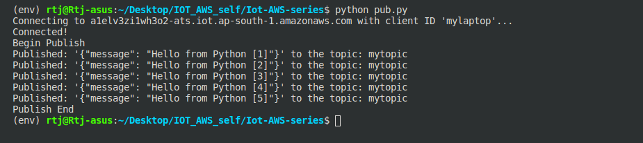

# AWS IOT Core tutorial with Python - Part 2

Hello builders and developers, in the [previous tutorial]() we had setup a secure and IOT Core messaging broker service on AWS and tested the publish/subscribe methods from Iot Core console on AWS and now we need to dive deeper into that stuff. If you have not read and followed the [previous tutorial]() I suggest you to do so because this tutorial is continued from where we left previously. We need to learn how to add extra security to our IoT Thing we made and how we can interact with it from outside AWS. So now that we have successfully created *MyIotThing* and also created certificates and policy for our thing. We will see why our current state of *MyIotThing* is less secured an how we can add additional security to it, before that we will need to setup our environment in Python and fulfill the requirements of client system setup. 

Please note that the setup which we are going to do is for a PC running Ubuntu Linux or can also be used in a Raspberry Pi/Orange Pi or other single board computers running a Debian based OS. For users with a Windows system I will include alternative steps in this tutorial so you need not worry. The core concepts shall be the same and in future I'll come up with a tutorial to connect embedded devices such as NodeMcu or Esp32 with Iot Core to sum up the concepts of client interactions with Iot Core. For now let's get started.

###  Pre-requisites -
1. [Followed AWS IOT Core tutorial with Python - Part 1]()
2. Patience and time.

### Client Interactions with AWS IOT Core

#### Step 1 - Setting up Python environment

##### For Linux(Debian) users -

1. Make sure you have pip installed in your system, to check run the following command in terminal,
    
    `pip3 --version`

    It should respond with the current version of pip you are using. If pip was not installed, install it by running, 

    `sudo apt-get install python3-pip`.

2. Make a new dir named as `IOT-AWS` run, 
    
    `mkdir IOT-AWS` 
   
   and then move into the dir run, 
    
    `cd IOT-AWS`
   
   We will do all this tutorial in this very dir.

3. Install a virtual environment wrapper run, 

    `pip3 install virtualenv`.

4. Now that virtualenv was succesfully installed we need to create a virtual environment using the virtualenv wrapper we just installed, run 
    
    `python3 -m venv iot-env` 
   
   Note that `iot-env` is the name of our environment and we are inside `IOT-AWS` dir. 

5. Now we will check whether our virtual environment was successfully created or not, for that we first make sure we are in `IOT-AWS` dir in the terminal and then we run,

    `ls`

   The above command lists down all the contents of the current dir which is `IOT-AWS` and we should see a dir named `iot-env` created inside the current dir.

6. Now we will activate the environment by running,

    `source iot-env/bin/activate`

   If the environment was successfully activated on your terminal, you would see *(iot-env)* before your username in the terminal. This virtual environment is activated and what it means is, that now whatever you will install in this environment via `pip` will only affect this environment's python interpreter and your global interpreter of Python shall remain unaffected, this ways we can work on diverse type of projects while not messing up with the original Python interpreter.

7. Now we need to install few things so run the following commands,

    `pip install -U pip` -- this will upgrade the pip version in the virtualenv to latest.
    
    `pip install awsiotsdk` -- this is the SDK (Software Development Kit) built for Python which helps us to interact with AWS IOT Core efficiently.


##### For Windows users -

1. Download and [install Chocolatey](https://docs.chocolatey.org/en-us/choco/setup#more-install-options) which is a package manager for Windows if it is already installed ignore this step.

2. Now we need to install Python3 - if already installed ignore this step, using Windows command line or Powershell run,

    `choco install python --version=3.8.0`.

3. Install pip and upgrade pip run,

    `choco install pip`
    `choco upgrade pip`

4. Install virtualenv wrapper run,

    `pip install virtualenv`.

5. Make a new dir named as `IOT-AWS` run, 
    
    `mkdir IOT-AWS` 
   
   and then move into the dir run, 
    
    `cd IOT-AWS`
   
   We will do all this tutorial in this very dir.

6. Create a virtualenv in the `IOT-AWS` dir run,

    `virtualenv iot-env`

   Note that a dir named `iot-env` appeared inside `IOT-AWS`, now we need to activate the `iot-env`.

7. Activate the env run,

    `\iot-env\Scripts\activate.bat`

   If the environment was successfully activated on your terminal, you would see *(iot-env)* before your username in the terminal. This virtual environment is activated and what it means is, that now whatever you will install in this environment via `pip` will only affect this environment's python interpreter and your global interpreter of Python shall remain unaffected, this ways we can work on diverse type of projects while not messing up with the original Python interpreter.

8.  Now we need to install few things so run the following commands in sequence,

    1. `pip install -U pip` --> this will upgrade the pip version in the virtualenv to latest.
    
    2. `pip install awsiotsdk` --> this is the SDK (Software Development Kit) built for Python which helps us to interact with AWS IOT Core efficiently.

We have successfully installed SDK for AWS and now we are done with setting up our system for both Linux and Windows based users. To deactivate the virtual environment we can press `Ctrl+D` in the terminal(may only work in Linux) or simply run `deactivate` command in terminal (works on both windows and Linux), only if we need to deactivate it at some point for now we are good to go.

#### Step 2 - Arranging the certificates

1. In th previous tutorial we had download two files which we re-named as `certificate.pem.crt` and `private.pem.key`, we need those two files now, but before that we will create a new dir inside `IOT-AWS` dir, named as `certs` run,

    `mkdir certs/`

2. Now grab the `certificate.pem.crt` and `private.pem.key` and paste it inside the `certs` dir we just created.

3. Now we need another certificate which is an Amazon public certificate, in order to interact with the services, run the following commands in sequence,

    1. `cd certs/` --> Move inside the `certs` dir.

    2. `wget https://www.amazontrust.com/repository/AmazonRootCA1.pem` --> This would download the public AmazonRootCA certificate and save is as `AmazonRootCA1.pem` file inside the `certs` dir. 

4. Let's now move out of the `certs` dir and create a new Python file, run the following commands in sequence,

    1. `cd ..` --> this command moves back one dir, so we should now be in IOT-AWS` dir.
    
    2. `touch pub.py` --> this command creates a new empty file. This command may not work on windows so you can manually create an empty `pub.py` file by right clicking > New file.

5. At this stage your directory structure should look like the following,

    ```
    IOT-AWS  ---|
                |
                |--- iot-env/
                |
                |--- certs/  ---|
                                |--- AmazonRootCA1.pem
                                |--- certificate.pem.crt
                                |--- private.pem.key
                |
                |--- pub.py   

    ```

Now that our directory structure is created we can start writing the Python script to publish a message to our broker, however we first need to open our IoT core console, and just to make sure everything is working fine till now, we can simply Test the publish/subscribe service from the console as we did in the previous tutorial. Once this is ensured, we can start writing our script. 

#### Step 3 - Publish a message through Python

Note that the `iot-env` virtualenv should be activated,

1. Open `pub.py` in a code editor and paste the following code and save it.

```python

from awscrt import io, mqtt, auth, http
from awsiot import mqtt_connection_builder
import time as t
import json

# Define ENDPOINT, CLIENT_ID, PATH_TO_CERT, PATH_TO_KEY, PATH_TO_ROOT, MESSAGE, TOPIC, and RANGE
ENDPOINT = "<your-endpoint>" # Hosting url
CLIENT_ID = "my-laptop1"  # name of device which interacts with Thing
PATH_TO_CERT = "certs/certificate.pem.crt"
PATH_TO_KEY = "certs/private.pem.key"
PATH_TO_ROOT = "certs/AmazonRootCA1.pem"
MESSAGE = "Hello from Python !!!"
TOPIC = "mytopic"
RANGE = 5 

# Spin up resources
event_loop_group = io.EventLoopGroup(1)
host_resolver = io.DefaultHostResolver(event_loop_group)
client_bootstrap = io.ClientBootstrap(event_loop_group, host_resolver)
mqtt_connection = mqtt_connection_builder.mtls_from_path(
            endpoint=ENDPOINT,
            cert_filepath=PATH_TO_CERT,
            pri_key_filepath=PATH_TO_KEY,
            client_bootstrap=client_bootstrap,
            ca_filepath=PATH_TO_ROOT,
            client_id=CLIENT_ID,
            clean_session=False,
            keep_alive_secs=6
            )
print("Connecting to {} with client ID '{}'...".format(
        ENDPOINT, CLIENT_ID))
# Make the connect() call
connect_future = mqtt_connection.connect()
# Future.result() waits until a result is available
connect_future.result()
print("Connected!")
# Publish message to server desired number of times.
print('Begin Publish')
for i in range (RANGE):
    data = "{} [{}]".format(MESSAGE, i+1)
    message = {"message" : data}
    mqtt_connection.publish(topic=TOPIC, payload=json.dumps(message), qos=mqtt.QoS.AT_LEAST_ONCE)
    print("Published: '" + json.dumps(message) + "' to the topic: " + TOPIC)
    t.sleep(0.5)
print('Publish End')
disconnect_future = mqtt_connection.disconnect()
disconnect_future.result()
``` 

2. We can see in the code in line no 7, `ENDPOINT = <your-endpoint>`, we need to replace this with actual endpoint of our thing. The endpoint is the hosting url for our *MyIotThing*, we can find it from our Iot Core console. Go to Console, on the left pane click **Things**, click on **MyIotThing**, on the left click on option **Interact**, we will see a url in black background, this is our endpoint copy it and paste it in the code without the `<>` signs, ie `ENDPOINT = just-paste-what you-copied` and save the file. An image below for reference shows where to find the endpoint. 

  

3. Open the IOT Core Console for *MyIotThing*, in the left pane locate **Test** click it and then Subscribe to any topic of your choice, however note that the topic we have subscribed on the console should be the same as what we have used in our publish script. Here in our script we have simply used *mytopic*, so we can subscribe to *mytopic* on console.

4. Now back to our PC's terminal, making sure we are in `IOT-AWS` dir, we will run the `pub.py` file, which will connect to IOT Core and get authorised and authenticated access to interact with *MyIotThing*, once connectioon is established, it will publish a message *"Hello from Python !!!"* to our *MyIotThing* at every 0.5 seconds for 5 times and then disconnect from our *MyIotThing*. To start the script run,

    `python pub.py`

  The script should run in the terminal and echo the message each time it publishes, the same message must be received by IOT Core in the Test console where we subscribed our topic as shown in the following two images.


Running publisher script from terminal


Subscribing the topic on console

We can play around a bit by changing the topic names and client ids in the code and see that all messages are received. 

Till now we have tried publishing messages to a topic using the Python AWSIoTSdk library, now we will try to subscribe messages using the same, finally we will publish and subscribe messages to a topic in two different terminal processes respectively, this way we will emulate the concept of IOT client nodes, where one node sends the data and the other node no matter where it is located receives it. Our published message from one terminal will travel from here to AWS Iot Core and all the way from Iot Core to our second terminal which has subscribed the message. So let's get started 

#### Step 4 - Subscribe to a topic through Python

1. On the PC, open terminal or command line or windows powershell and move into the *IOT-AWS* dir where the other file `pub.py` exists,

    `cd IOT-AWS`

2. Create a new empty python file named as `sub.py` by running,

    `touch sub.py`

3. Copy the following code and paste into `sub.py`, while also replacing the `ENDPOINT` in the code with your endpoint as done previously.

```python

from awscrt import io, mqtt, auth, http
from awsiot import mqtt_connection_builder
import threading
import time as t
import json

# Define ENDPOINT, CLIENT_ID, PATH_TO_CERT, PATH_TO_KEY, PATH_TO_ROOT, TOPIC
ENDPOINT = "<your-endpoint>"
CLIENT_ID = "mylaptop2"
PATH_TO_CERT = "certs/certificate.pem.crt"
PATH_TO_KEY = "certs/private.pem.key"
PATH_TO_ROOT = "certs/AmazonRootCA1.pem"
TOPIC = "mytopic"

count = 5 # define count to end after receiving 5 msgs
received_count = 0
received_all_event = threading.Event()


# Callback when the subscribed topic receives a message
def on_message_received(topic, payload, dup, qos, retain, **kwargs):
    print("Received message from topic '{}': {}".format(topic, payload))
    global received_count
    received_count += 1
    if received_count == count:
        received_all_event.set() # indicates that all messages have been received

# because we are dealing with functional programming paradigm, 
# as we have a on_message_received() callback function, 
# we need a main loop to run our program unlike in pub.py
if __name__=='__main__':

    # Spin up resources
    event_loop_group = io.EventLoopGroup(1)
    host_resolver = io.DefaultHostResolver(event_loop_group)
    client_bootstrap = io.ClientBootstrap(event_loop_group, host_resolver)
    mqtt_connection = mqtt_connection_builder.mtls_from_path(
                endpoint=ENDPOINT,
                cert_filepath=PATH_TO_CERT,
                pri_key_filepath=PATH_TO_KEY,
                client_bootstrap=client_bootstrap,
                ca_filepath=PATH_TO_ROOT,
                client_id=CLIENT_ID,
                clean_session=False,
                keep_alive_secs=6
                )

    print("Connecting to {} with client ID '{}'...".format(
            ENDPOINT, CLIENT_ID))
    # Make the connect() call
    connect_future = mqtt_connection.connect()
    # Future.result() waits until a result is available
    connect_future.result()
    print("Connected!")

    try:
        print("Subscribing to topic : " + TOPIC)
        subscribe_future, packet_id = mqtt_connection.subscribe(
            topic=TOPIC,
            qos=mqtt.QoS.AT_LEAST_ONCE,
            callback=on_message_received
        )

        subscribe_result = subscribe_future.result()
        print("Subscribed with {}".format(str(subscribe_result['qos'])))

        if not received_all_event.is_set():
            print("Waiting for messages.....")

        received_all_event.wait() # This keeps the thread running untill received_all_event is set()
        print("{} message(s) received.".format(received_count))
        
        # Disconnect
        print("Disconnecting...")
        disconnect_future = mqtt_connection.disconnect()
        disconnect_future.result()
        print("Disconnected!")

    except KeyboardInterrupt:
        # Disconnect
        print("Disconnecting...")
        disconnect_future = mqtt_connection.disconnect()
        disconnect_future.result()
        print("Disconnected!")
```

What the above code does is, like the previous code in `pub.py` it establishes connection to the *MyIotThing* through the endpoint url, then it gets subscribed to a topic in a separate Thread, and waits unitll the number of messages are received as defined in count variable. As in previous code `pub.py` we were sending 5 messages at *0.5* seconds interval, we have set the count here as well as 5, so that after 5 messages it disconnects automatically. Also we have a try-except block, which is to handle the KeyboardInterrupt which is `Ctrl+C`, so if in between while it is still running and waiting to receive the messages we can simply and efficiently close the connection by pressing `Ctrl+C`. The try-except block just increases efficiency of the code and nothing else. 

4. Don't forget to replace the endpoint as done previously with publisher code. We can now save our `sub.py` file and run it,

    `python sub.py`

5. It should get subscribed to the topic *mytopic* and should wait untill 5 messages are recieved. To test it we can use the IoT Core console to publish messages on this topic and see the message should be printed in the terminal.

6. Spin up the two terminals for publish and subscribe respectively, emulating the IOT concept, where one IOT device is programmed to send(publish) messages and the other device is programmed to receive (subscribe) messages. We will run the `sub.py` again,

    `python sub.py`

7. Now let the `sub.py` terminal running and open a new terminal and move into `IOT-AWS` dir, activate the virtual environment and run the `pub.py` file,

    `python pub.py`

8. Now you should see the messages sent from one terminal get received in the other terminal, below is an image for your reference.


Congratulations !!! We have successfully tested the publish and subscribe methods of MQTT protocol on Iot Core, which builds the base of the damn big field of IoT. However something, I feel important to discuss whether you noticed or not, in both the codes of `pub.py` and `sub.py` the `CLIENT_ID` is different, which needs to be so, because the publisher and subscriber are two different clients for the *MyIotThing* or say Iot Core messaging broker itself, the same client can publish and subscribe to the same topic, however it can't make two different connections to the broker, because one client needs just one connection, here we have two clients therefore we kept the client_id different and two connections were made. Now you would think what could happen if the client_id in both the scripts is same, then I would say it is better to try that out and observe, however messages in such case will get lost while there will be no error in connection.

### Enhancing the security of our Thing

Now that we have established communication with our *MyIotThing* we can connect as many clients as we want to our broker, but is it the right way ? Let's take the example of a use case and discuss, suppose there are 5 developers in a company who have access to the IOT Core and more specifically the Things in Iot Core. Now the company launches a product that it sells for revenue, now two of the developers try to sell their own copy of the product without the knowledge of the company and earn self profits, they can just create new clients and access the broker on the cost of the company and company could remain unaware about it. This is definetely an integrity issue, but in diverse environments and with diverse mentality of people anything is possible. So in order to prevent such type of scenarios, the company should at all times know which clients can access this broker, that means there should be some kind of permission or restrictions for specific clients to access and interact with the services. AWS provides the solution for such security enhancement through its policies, as we had discussed in the previous tutorial that policies grant permissions to access the services on AWS, we will now modify our existing *MyIotPolicy* to enhance the security and permit only specific clients to interact with the service.  

Let's open our Iot Core console and in the left pane expand **Secure** tab and click **Policies**, then click the **MyIotPolicy**, at the right above the json policy we have to click the **Edit policy document** and paste the following policy in it,

```json
{
    "Version": "2012-10-17",
    "Statement": [
        {
            "Effect": "Allow",
            "Action": [
                "iot:Publish",
                "iot:Receive"
            ],
            "Resource": [
                "arn:aws:iot:region:account:topic/test/topic"
            ]
        },
        {
            "Effect": "Allow",
            "Action": [
                "iot:Subscribe"
            ],
            "Resource": [
                "arn:aws:iot:region:account:topicfilter/test/topic"
            ]
        },
        {
            "Effect": "Allow",
            "Action": [
                "iot:Connect"
            ],
            "Resource": [
                "arn:aws:iot:region:account:client/test-*",
                "arn:aws:iot:region:account:client/thing-*"
            ]
        }
    ]
}
```
In the "Resource" element, you should replace the region and account word with your AWS account and Region *"arn:aws:iot:region:account.:topic/test/topic"* .
So now we have to replace the *Resource* in each statement block of the policy, so let's see how we can find our exact Resource to input in the policy, we will look at the top navigation bar at the right on AWS IOT Core Console, we could see the region name as Ohio or Mumbai, etc, this is the region which hosts our *MyIotThing*, in my case it is Mumbai, click on the small dropdown arrow beside the region name and we will see a list of region names with their codes, so we will copy the region code for our IOT core hosted region, in my case it is *ap-south-1* and replace it with the region in all the *Resource* fields. Then we need account id, if we are logged in as IAM user we can find our UserID on the navigation bar looking something like *IotUser@42523355266*, the number after the *@* sign is the account id, we can copy it and replace it in the *Resource* fields. However if we are logged in as Root user, then root UserID is shown on the navigation bar, so in that case we can click the dropdown arrow beside the UserID and find the account id labelled beside *My Account* in the dropdown menu. Finally after modifying the *Resource* fields correctly, we need to check the **Set as default** option and then click **Save as new version** above the json policy editor. Now if we click **Versions** from the left pane of *MyIotPolicy* we can see two versions of the policy listed and version 2 is currently active. 

Now after successfully activating version 2 of the policy, I recommend you to take a look and understand what changes have been made to this policy, but before that if we try to run our `pub.py` and `sub.py` they won't connect to our *MyIotThing* and will result in errors. 

The changes we have made in our policy, now tell that only clients, with *CLIENT_ID* starting with `test-` or `thing-` can Connect to the broker, ie *CLIENT_ID="test-123"* or *CLIENT_ID="thing-xyz"* or *CLIENT_ID="test-"* will only be able to Connect. The asterik sign allows all values after *test-* or *thing-*. We will make the changes in `pub.py` and `sub.py` editing the *CLIENT_ID* variable as discussed here. 

Next for Publish, Receive and Subscribe only, one topic can be used, which is *"test/topic"*. So we will make these changes in the `pub.py` and `sub.py` and then try running it, it should connect and work as desired. 

Now we have successfully restricted any client to connect to our *MyIotThing*, thus enhanced the security of the system. If we want to add more topics to our policy we can simply add other *Resource arn* as comma (,) separated values.

### Conclusion

So developers and builders I would heartily congratuale you on successfully getting your hands and minds dirty with AWS IOT Core Service and Python awsiotsdk. Now I am sure you must have built a strong concept of how secured Iot data transmission takes place and how things happen in real production environments. By now we have learnt not only about IOT but also about 2 AWS Services which are IAM and Iot Core. We also have a basic idea about how Amazon Web Services are designed as we know somewhat good about how Polies and IAM users work. This is a great learning achievement guys, I will now end this up and next upcoming tutorials for IOT we will learn about other AWS services such as AWS Lambda and Dynamo DB as well, also at some point we may test these things with embedded device clients such as Nodemcu or Esp32. 

Thankyou and Happy Learning !!!
